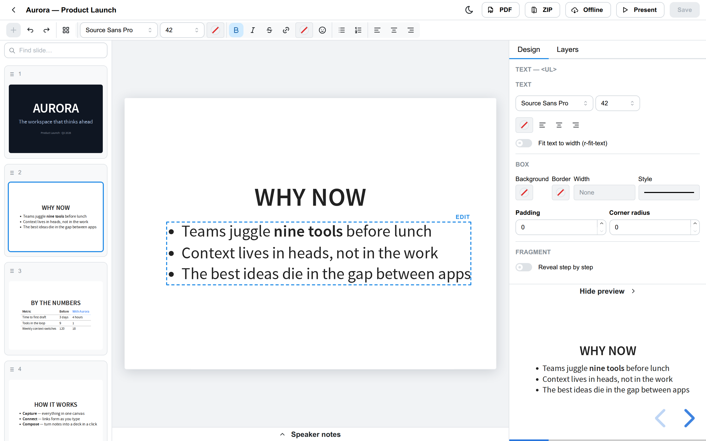
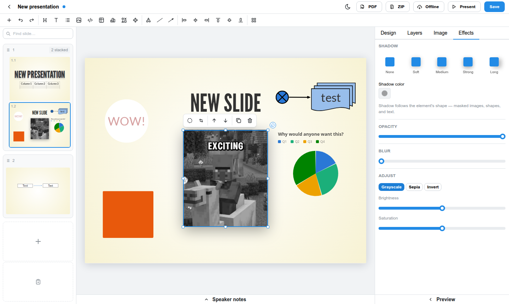

# RevealEditor

A WYSIWYG editor for [reveal.js](https://revealjs.com/) presentations. The reveal.js HTML
file on disk is the only source of truth — open existing hand-written decks, edit them
visually, save back clean HTML. No lock-in, git-friendly diffs, decks stay standalone.

📖 **[Browse the documentation & landing page →](https://heolin.github.io/RevealEditor/)**
&nbsp;·&nbsp; [User guide](https://heolin.github.io/RevealEditor/usage.html)
&nbsp;·&nbsp; [Feature catalog](https://heolin.github.io/RevealEditor/features.html)
&nbsp;·&nbsp; [Architecture](https://heolin.github.io/RevealEditor/architecture.html)


*Edit slides visually at full theme fidelity — the slide sorter on the left, the design
canvas in the middle, and a context inspector on the right.*

## A look around

<table>
  <tr>
    <td width="50%">
      <a href="docs/images/text-formatting.png"></a>
      <br><b>In-place text editing</b> — WYSIWYG at theme fidelity, with a full formatting ribbon.
    </td>
    <td width="50%">
      <a href="docs/images/table-editing.png"></a>
      <br><b>Tables</b> — cell editing, rows/columns, merge/split, style presets, CSV paste.
    </td>
  </tr>
  <tr>
    <td width="50%">
      <a href="docs/images/chart-modal.png"></a>
      <br><b>Charts</b> — bar, line, area, pie, scatter & combo, baked as standalone SVG.
    </td>
    <td width="50%">
      <a href="docs/images/shapes-gallery.png"></a>
      <br><b>Shapes & diagrams</b> — a gallery of shapes plus connectors that stay attached.
    </td>
  </tr>
  <tr>
    <td width="50%">
      <a href="docs/images/insert-menu.png"></a>
      <br><b>Insert anything</b> — text, images, tables, charts, shapes, code from one menu.
    </td>
    <td width="50%">
      <a href="docs/images/effects.png"></a>
      <br><b>Effects</b> — drop shadow, opacity, blur, and image adjustments per element.
    </td>
  </tr>
</table>

## What it does

- **Slides**: 2-D sorter (horizontal + vertical stacks), add/duplicate/delete/reorder by
  drag, hidden-slide badge, jump-to-slide search, copy/paste slides across decks
- **Text**: in-place WYSIWYG at theme fidelity — click to select, click again to edit;
  bold/italic/strike, links, headings, lists, alignment, text/highlight color, font size
  and family, emoji & icon pickers, `r-fit-text`; plain-text paste
- **Tables**: cell editing, add/remove rows & columns, header toggle, alignment, cell
  colors, drag column resize, merge/split cells, TSV/CSV paste, style presets
- **Charts**: bar (grouped/stacked), horizontal bar, line, area, pie/donut, scatter and
  combo; data grid + CSV paste, number formatting, theme palettes — baked as standalone
  SVG with the editable spec kept in `data-re-chart` (raw-JSON escape hatch)
- **Shapes & diagrams**: shapes gallery (base + flowchart), fill/stroke/dash/opacity,
  two-point connectors that snap to box anchors and stay attached, shape labels,
  rotation & flip on every element
- **Images & code**: images (upload/paste/URL) with border/radius/shadow, crop, mask and
  effects; code blocks in a CodeMirror editor with reveal's step-by-step line highlights
- **Layout**: drag anything to position it freely (plain inline styles — valid reveal),
  resize with snap guides, arrow-key nudge, z-order, align & distribute, group/ungroup,
  layers panel, back-to-flow
- **Animations**: fragments (variants, ordering, in-editor step preview, group reveal),
  per-slide & background transitions, **auto-animate** with a duplicate-for-step helper
- **Presenting & export**: speaker notes, live preview with the real reveal runtime,
  Present opens the actual file; export to **PDF**, **zip** (deck + assets), and
  **bundle offline** (vendor the CDN reveal.js for airgapped presenting)
- **Fidelity**: untouched slides are saved byte-identical; comments travel with their
  slides; hand-written markup the editor doesn't understand is never rewritten;
  fully custom-styled decks (no standard theme) are supported

## Quick start

```bash
npm install
npm run dev          # editor UI on http://localhost:5173, API on :4321
```

The dev server opens the `demo-workspace/` folder. To edit your own presentations:

```bash
npm run build
node server/dist/index.js ~/path/to/your/talks --port 4321
# then open http://localhost:4321
```

Any `.html` file containing a reveal.js `div.slides` is picked up automatically.

You can also switch folders from the deck list at runtime — off by default;
enable with `--allow-workspace-change`, or copy `revealeditor.config.example.json`
to `revealeditor.config.json` and set `"allowWorkspaceChange": true`. Keep it
**off** when hosting. See
[Choosing a workspace folder](docs/USAGE.md#choosing-a-workspace-folder).

New here? The [user guide](docs/USAGE.md) walks through editing a deck end to end.

## Documentation

- [docs/USAGE.md](docs/USAGE.md) — user guide (task-oriented walkthrough)
- [docs/TUTORIAL.md](docs/TUTORIAL.md) — hands-on tutorial with screenshots
- [docs/FEATURES.md](docs/FEATURES.md) — feature catalog with priority tiers
- [docs/ARCHITECTURE.md](docs/ARCHITECTURE.md) — system architecture, element handler
  registry, extension points, real-deck compatibility learnings
- [docs/DIAGRAMMING.md](docs/DIAGRAMMING.md) · [docs/TOOLBARS.md](docs/TOOLBARS.md) ·
  [docs/ROADMAP.md](docs/ROADMAP.md)

These also render as a browsable site (landing page + docs) published to GitHub Pages at
**[heolin.github.io/RevealEditor](https://heolin.github.io/RevealEditor/)** by
`.github/workflows/pages.yml`. Build it locally with `npm run build:site` and open
`_site/index.html`.

## Development

```bash
npm test            # round-trip fidelity + editor unit suites
npm run typecheck
npm run build
```

Repository layout: `server/` (Express, parse5 splice engine, workspace API),
`client/` (React/Vite editor), `demo-workspace/` (sample decks for development).
