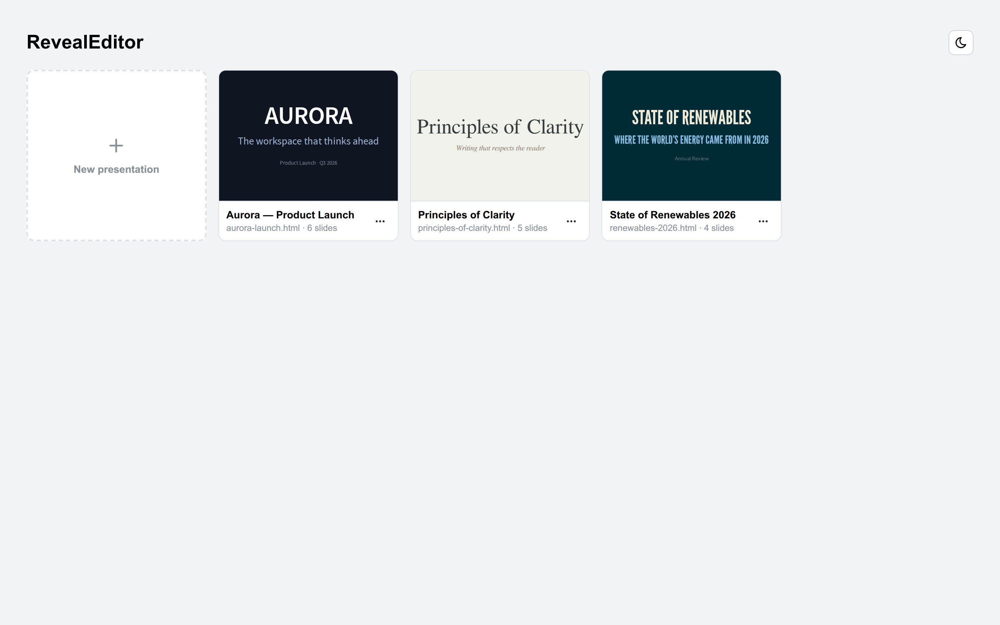
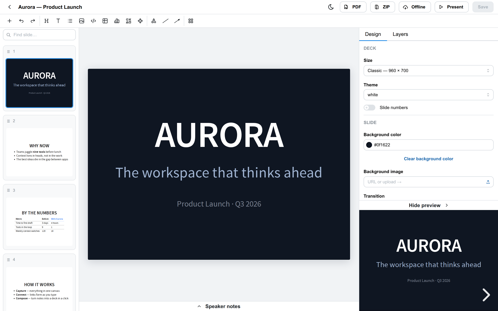
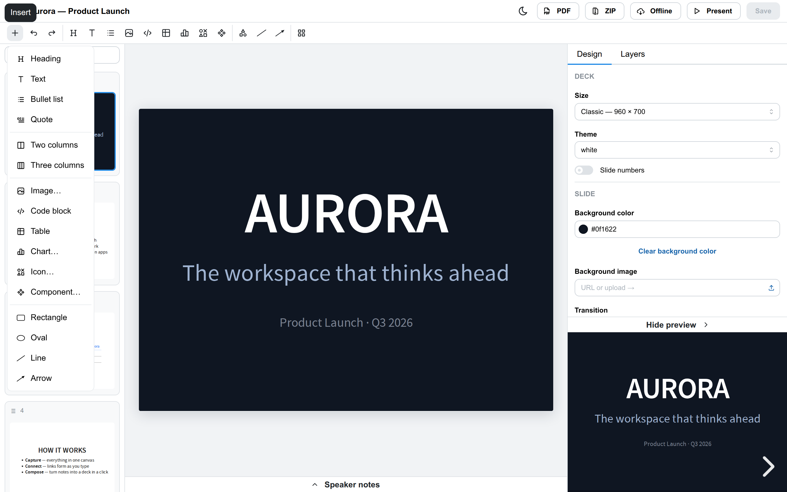
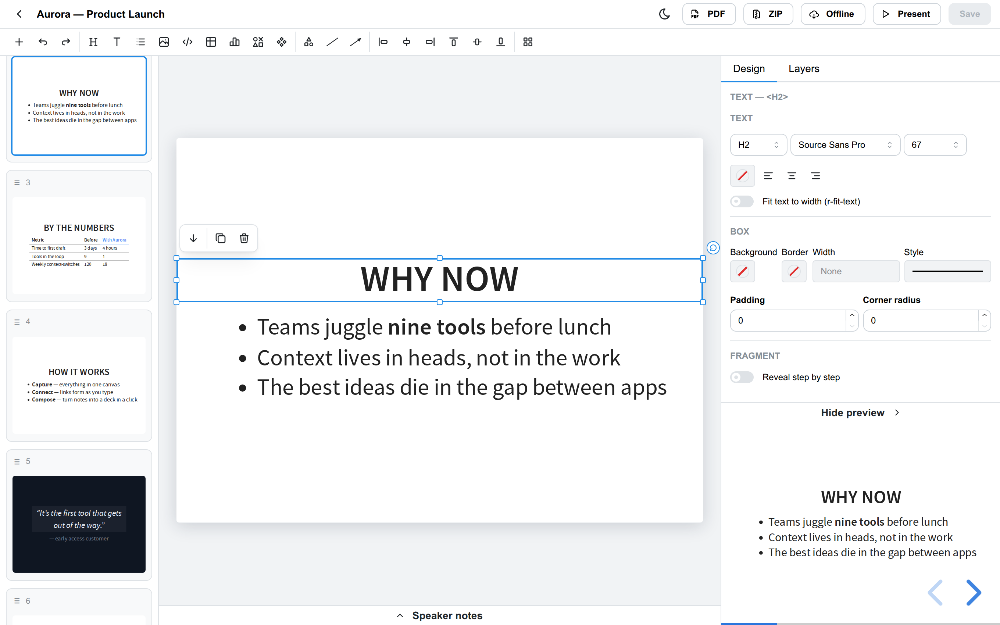

# Tutorial: your first deck

A hands-on walkthrough. By the end you'll have opened a deck, edited it, added
content, and exported it — the whole loop. It takes about ten minutes. For a
reference-style rundown of every feature, see the [user guide](USAGE.md).

> **Setup:** if the app isn't running yet, do `npm install` then `npm run dev`
> and open <http://localhost:5173>. See [Getting started](USAGE.md#getting-started)
> to point it at your own folder of talks.

## 1. Pick a deck

The first screen lists every reveal.js deck in your workspace, with its title,
slide count and when it was last changed.

Click a deck to open it, or **New presentation** to start from a template
(you'll choose a title, theme and slide size). For this tutorial, open the
**RevealEditor demo deck**.

## 2. Get your bearings

The editor has four areas:

- **Sorter** (left) — every slide in the deck as a 2-D map. Horizontal =
  the main flow; vertical stacks = sub-slides. Drag to reorder; hover a
  thumbnail for its actions.
- **Canvas** (center) — the current slide, rendered with the deck's real
  theme. This is where you edit.
- **Toolbar** (top) — the formatting ribbon plus deck actions (PDF, ZIP,
  Offline, Present, Save).
- **Inspector** (right) — properties for whatever is selected, or for the
  slide itself when nothing is.

## 3. Edit some text

Click a heading or paragraph on the canvas to **select** it; click again (or
press Enter) to **edit** it. Type as you would anywhere. The formatting ribbon
gives you bold/italic, links, headings vs paragraph, lists, alignment, and text
/ highlight color — all rendered at true theme fidelity, so what you see is what
presents.

Click an empty part of the slide (or press Escape) to finish editing.

## 4. Add something

Open the **Insert** menu for images, tables, charts, code blocks, shapes and
more.

Try **Chart**: a dialog opens with a data grid (paste CSV/TSV straight in),
type and color options. When you're done it bakes into the slide as a plain
SVG — your deck stays standalone, but you can reopen and re-edit the chart any
time because its data lives on the element.

Shapes work by dragging on the canvas from the **Draw** group — you'll see a
live preview as you draw. Lines and arrows snap their endpoints to nearby boxes
and stay attached when you move things, which makes quick diagrams painless.

## 5. Select, inspect, position

Select any element and the **inspector** fills with its properties — size,
colors, borders, and type-specific options.

Drag an element to position it freely; snap guides help you line things up, and
the arrow keys nudge (hold Shift for bigger steps). Everything you do writes
plain, valid reveal.js markup — inline styles, standard classes — never a
proprietary format. Changed your mind? **Return to flow** strips the
positioning back to normal layout.

## 6. Make it move (optional)

Reveal's **fragments** reveal elements one step at a time. Select an element,
turn on a fragment in the inspector, and pick an effect; reorder them in the
fragment list. You can step through them right in the editor without launching
the presentation.

For slide-to-slide motion, toggle **auto-animate** on a slide and use the
sorter's *Duplicate for auto-animate step* — edit the copy and reveal morphs
between the two.

## 7. Present and export

- **Present** opens the actual file — exactly what your audience sees.
- **PDF** exports a print-ready PDF in one click.
- **ZIP** downloads the deck plus its local assets, ready to hand off.
- **Offline** vendors the CDN reveal.js into the deck folder so it presents
  with no network — pair it with ZIP for a fully self-contained bundle.

## 8. Save

Hit **Save** (Ctrl/Cmd+S). RevealEditor writes clean HTML back to the same
file — slides you didn't touch stay byte-for-byte identical, so your version
history only shows what actually changed.

That's the whole loop. From here, the [user guide](USAGE.md) covers each area
in more depth, and [publishing](USAGE.md#exporting-and-publishing) shows how to get
a finished deck online.
