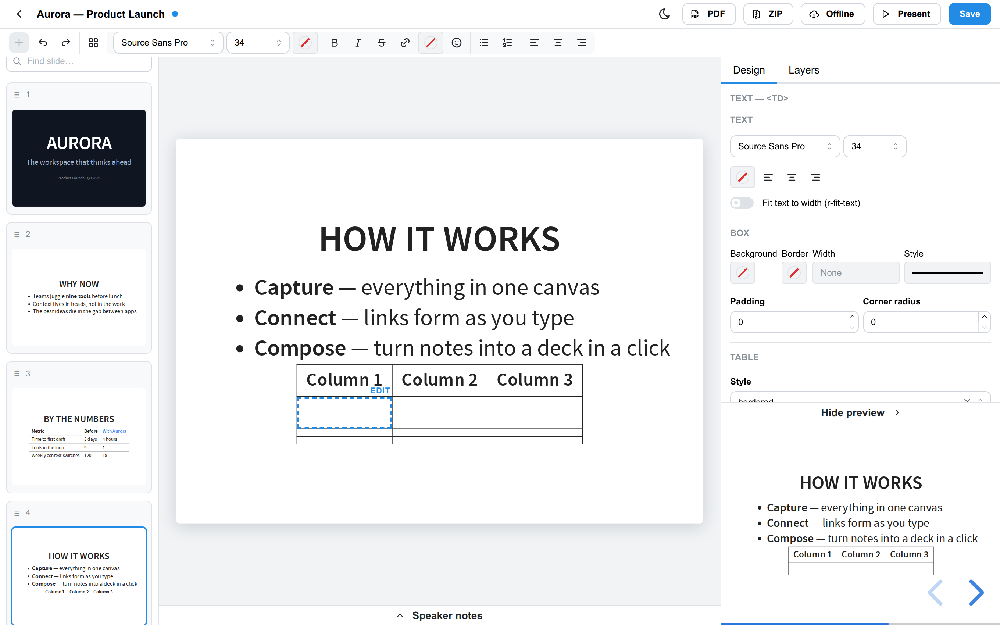
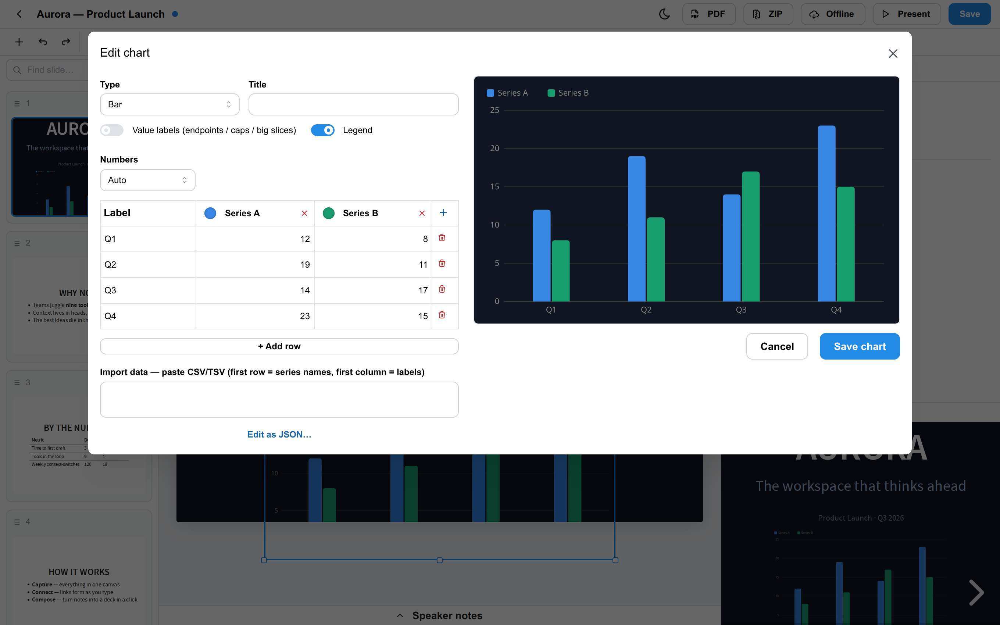
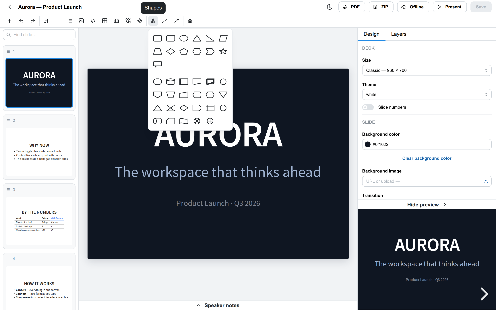

# RevealEditor — User Guide

A task-oriented guide to editing presentations with RevealEditor. It assumes
you have the app running (see [Getting started](#getting-started)); for what
the product can do at a glance, see the [feature catalog](FEATURES.md).

RevealEditor edits ordinary [reveal.js](https://revealjs.com/) decks. The HTML
file on disk is the only source of truth: you open a hand-written deck, edit it
visually, and save clean, standalone HTML back. Nothing you make depends on
RevealEditor to present.

## Getting started

```bash
npm install
npm run dev          # editor UI on http://localhost:5173
```

The dev server opens the bundled `demo-workspace/` folder. To edit your own
talks, build once and point the server at any folder:

```bash
npm run build
node server/dist/index.js ~/path/to/your/talks --port 4321
# then open http://localhost:4321
```

Any `.html` file containing a reveal.js `div.slides` is detected automatically.

## Choosing a workspace folder

The **workspace** is the folder RevealEditor scans and edits. It's chosen when
the server starts, in this order of precedence:

1. A folder passed on the command line — `node server/dist/index.js ~/talks`.
2. The `workspace` value in the server config file (see below), if present.
3. The current working directory.

### Switching folders from the app

You can also change the folder from the deck list — a **Change folder…** button
next to the workspace path. This is handy locally, but because it re-roots the
server to *any* directory on the machine, it is **off by default**. Enable it:

- per run, with a flag: `node server/dist/index.js ~/talks --allow-workspace-change`, or
- persistently, in the config file: `"allowWorkspaceChange": true`.

When it's off, the button is hidden and the switch API refuses (`403`).

> **Hosting note.** If you expose RevealEditor beyond your own machine, leave
> workspace switching **off**. The editor has no authentication, so an enabled
> switch lets anyone re-root it to browse the server's filesystem.

### The server config file

Settings live in **`revealeditor.config.json`** in the project directory (not
your home folder), so configuration travels with the deployment. Point at a
different file with `--config <path>`.

The repo ships **`revealeditor.config.example.json`** as a template. Copy it and
edit:

```bash
cp revealeditor.config.example.json revealeditor.config.json
```

```json
{
  "workspace": "/home/you/talks",
  "allowWorkspaceChange": true
}
```

`revealeditor.config.json` itself is git-ignored (it ends up holding local
paths), so your copy stays out of version control. Switching folders in the app
updates `workspace` here, so the next start (without a command-line folder)
resumes where you left off.

## The deck list

The landing screen scans your workspace folder (recursively) and shows every
deck with its title, slide count and last-modified time. From here you can:

- **New presentation** — create a standalone deck from a template (title +
  theme + slide size). Or **New from Markdown** if that option is present.
- **Open** a deck to edit it.
- **Rename**, **Duplicate**, or **Delete** a deck.

## The editor at a glance

- **Slide sorter** (left) — a 2-D map of the deck: horizontal columns are the
  main flow, vertical stacks are sub-slides. Live thumbnails.
- **Canvas** (center) — the current slide at true theme fidelity. Click to
  select an element, click again (or press Enter) to edit it.
- **Toolbar** (top) — the format ribbon plus deck-level actions: theme toggle,
  **PDF**, **ZIP**, **Offline**, **Present**, and **Save**.
- **Inspector** (right) — properties for the selection (or the slide when
  nothing is selected): background, transition, auto-animate, fragments, and
  element-specific fields.

Changes are tracked in a single undo history (**Ctrl/Cmd+Z** / **Shift+Ctrl/Cmd+Z**).
A dot next to the deck title means there are unsaved changes; **Save**
(**Ctrl/Cmd+S**) writes to disk. If the file changed on disk outside the editor
you get a banner to reload or keep editing.

## Managing slides

In the sorter, hover a thumbnail for its action buttons, or drag to reorder
(including into and out of vertical stacks):

- **Add slide after** / **Add below (stack)** — new blank slide beside or under.
- **Duplicate** — copy the slide.
- **Duplicate for auto-animate step** — copy the slide *and* flag both copies
  with `data-auto-animate` so reveal morphs between them (see [Animations](#animations)).
- **Copy slide** — puts the `<section>` on the clipboard; paste into any deck.
- **Delete**.

Use the search box to jump to a slide by its text content. Mark a slide hidden
from the inspector (`data-visibility="hidden"`) — it stays in the file but is
skipped when presenting.

## Editing text

Click an element to select it, then click again to start editing. The text
toolbar offers bold/italic/strikethrough/inline code, links, headings H1–H6 ⇄
paragraph, bulleted and numbered lists (Tab / Shift-Tab to nest), blockquotes,
and per-block alignment. You also get text color and highlight color, font size
and font family, and an emoji / special-character picker.

Pasting text strips Word/Docs formatting by default. Toggle `r-fit-text` on a
headline to auto-fit it to the slide.

## Images

Insert an image by upload, paste, or URL — uploads land in an `assets/` folder
beside the deck. Resize with handles (Shift keeps the aspect ratio), set alt
text and title in the inspector, and apply rounded corners, border or shadow.

## Tables

Insert a table with the size-picker grid, then edit cells in place. Tab and the
arrow keys move between cells. You can add/remove rows and columns, toggle a
header row/column, set per-cell alignment and colors, drag column boundaries to
resize, and merge/split cells. Paste TSV/CSV from a spreadsheet to fill or grow
a table.



## Charts

Charts are **baked into the deck as inline SVG** — no chart runtime ships with
your deck — while the editable spec lives in a `data-re-chart` attribute so you
can reopen and re-edit them. Insert a chart to open the modal:

- Pick a type: bar (grouped/stacked), horizontal bar, line, area, pie/donut,
  scatter, or combo (bars + line).
- Enter data in the grid or paste CSV/TSV; add/remove series.
- Set titles, axis labels, legend position, value labels and number formatting.
- Colors default from the theme; override per series. Raw-JSON editing is
  available as an escape hatch.



## Shapes & diagrams

Open the **Draw** group (or the shapes gallery) for rectangles, ellipses,
lines, arrows, and flowchart shapes. Draw by dragging on the canvas; you'll see
a live preview of the shape. Set fill, stroke color/width/dash and opacity in
the inspector.



Lines and arrows are **two-point connectors**: drag either endpoint, and it
snaps to one of the 8 anchor points on nearby elements. Attached endpoints stay
connected when you move the box. Click a selected shape and type to add a
centered label. See [DIAGRAMMING.md](DIAGRAMMING.md) for the full subsystem.

## Layout & positioning

By default slides use reveal's natural centering. Drag any element to position
it freely — this writes plain inline styles (valid reveal), never a proprietary
format. While dragging you get snap guides to slide edges/centers and sibling
edges. Nudge with the arrow keys (1px, or 10px with Shift). Other tools:

- **Return to flow** — strip positioning back to normal layout.
- **Z-order** — bring forward/backward/front/back.
- **Align & distribute** selected elements; **group/ungroup**; a **layers**
  panel shows the element tree of the current slide.
- **Duplicate** with **Ctrl/Cmd+D** or Alt-drag.

## Animations

**Fragments** reveal elements step by step. Toggle a fragment on any element
and choose an effect; reorder them in the inspector's fragment list
(`data-fragment-index`). Step through them in the editor without running reveal.
Give several elements the same index to reveal them together.

**Transitions** — set a per-slide transition and background transition in the
inspector (deck default otherwise).

**Auto-animate** — toggle it on a slide to morph matching elements in from the
previous slide. The fastest way to author a sequence is the sorter's
**Duplicate for auto-animate step**: it copies the slide and flags both, so you
just edit the copy (move, resize, restyle) and reveal animates the difference.

## Backgrounds & theming

Per slide, set a background color, gradient or image in the inspector. For the
whole deck, switch between built-in reveal themes (this rewrites the theme
`<link>`). Fully custom-styled decks — with their own `<style>` blocks and no
standard theme — are supported and rendered faithfully in both the canvas and
the preview.

## Presenting

- **Speaker notes** — write per-slide notes in the notes drawer
  (`<aside class="notes">`).
- **Live preview** — a pane running the real reveal.js runtime follows the slide
  you're editing.
- **Present** — opens the actual file, exactly what your audience sees. Reveal's
  speaker view works if the notes plugin is in the deck.

## Exporting and publishing

- **PDF** — one click. If the optional server dependency is installed it renders
  a real PDF; otherwise it falls back to reveal's guided print flow (choose
  "Save as PDF", margins: None).
- **ZIP** — download the deck plus its referenced local assets as a `.zip`, with
  paths preserved so it unpacks ready to open.
- **Offline** — vendor the deck's CDN reveal.js `<link>`/`<script>` files into a
  `vendor/` folder beside the deck and rewrite the references, so the deck
  presents with no network. Pair it with **ZIP** for a fully airgapped bundle.
- **Publish to GitHub Pages** — a deck is just standalone HTML, so any static
  host works. To publish on GitHub Pages: run **Offline** (so nothing depends on
  a CDN), then commit the deck folder to a repository and enable Pages for the
  branch — the deck opens at its `…/deck.html` URL.

## Fidelity guarantees

- Slides you don't touch are saved **byte-identical**.
- Comments and hand-written markup the editor doesn't understand are preserved,
  never rewritten.
- Rich blocks (charts, shapes, tables) carry their editable source inside the
  HTML, so reopening a deck restores full editability with no sidecar files.
